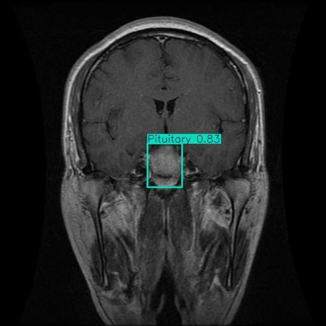

# 🧠 Brain Tumor Detection Using MRI Scans with YOLOv11

[](https://colab.research.google.com/github/muhammed-neccar/brain-tumor-detection-yolov11/blob/main/notebook.ipynb)

This project presents a comprehensive approach to detect and classify brain tumors from MRI scans using the state-of-the-art YOLOv11 object detection framework.  
It is designed as an accessible and practical guide for researchers, developers, and medical AI enthusiasts who want to build effective models for medical image analysis without requiring extensive computational resources.

---

## 📌 **Project Overview**

- **Framework:** [YOLOv11](https://github.com/ultralytics/yolov11) — a cutting-edge, fast and accurate object detection model  
- **Dataset:** Labeled MRI Brain Tumor Dataset containing 2443 images, annotated by medical experts  
- **Classes:**

  - Pituitary Tumor  
  - Meningioma Tumor  
  - Glioma Tumor  
  - No Tumor (Healthy cases)  
- **Platform:** Google Colab — enables easy access to GPUs and seamless experimentation without local hardware requirements  

This project covers:  
✅ Data acquisition and expert labeling process  
✅ Dataset loading and preprocessing via Roboflow  
✅ Configuring and training YOLOv11 for multi-class tumor detection  
✅ Model evaluation with standard metrics such as Precision, Recall, and mAP  
✅ Visualization of tumor detection results on MRI images  

---

## 📊 **Dataset Details**

- Total Images: 2443 MRI scans  
- Training Set: 1695 images  
- Validation Set: 502 images  
- Test Set: 246 images  
- Annotation Details: Each image is labeled with tumor type and tumor location, ensuring precise ground truth for supervised learning  
- Source: Medical experts have meticulously labeled the dataset following standardized protocols, increasing the dataset’s reliability for clinical use  

---

## 🚀 **How to Use**

1. Clone the project repository:  
   ```bash
   git clone https://github.com/your-username/brain-tumor-detection-yolov11.git

2. Open the provided Jupyter Notebook or Google Colab file for guided training and evaluation.
3. Follow the step-by-step instructions to:
     - Download and prepare the dataset using Roboflow integration

     - Train the YOLOv11 model on the labeled MRI images

     - Evaluate the model on the validation and test sets

     - Visualize the detection bounding boxes and class predictions on MRI scans

   
4. Customize hyperparameters or extend the dataset for further experimentation.

  ## 📈  Results
- Reliable detection and classification of brain tumors in MRI scans

- High accuracy in tumor localization with bounding boxes around affected areas

- A solid baseline model that can be fine-tuned for specific clinical settings or research objectives

- Model performance evaluated using metrics like mAP (mean Average Precision), Precision, and Recall
## 📊 Example Result



## ⚙️ Potential Applications
- Supporting radiologists with AI-powered diagnostic tools for faster, more accurate tumor identification

- Accelerating medical image analysis workflows in hospitals and clinics

- Providing a foundation for research in brain tumor progression and treatment planning

- Developing real-time detection tools integrated into medical imaging devices or software

## 🔭 **Future Directions**
- Expanding the dataset with more diverse MRI scans and tumor types

- Experimenting with ensemble models and YOLOv11 variants to improve robustness

- Deploying the trained model into cloud services or mobile applications for broader accessibility

- Collaborating with medical institutions to validate and enhance the model’s clinical utility

## ✏️ **Author**
Mohammed
Computer Engineering Graduate, Iğdır University
AI enthusiast passionate about medical imaging and deep learning research

## ⭐ **Feel free to fork, contribute, or open issues for improvements!**


